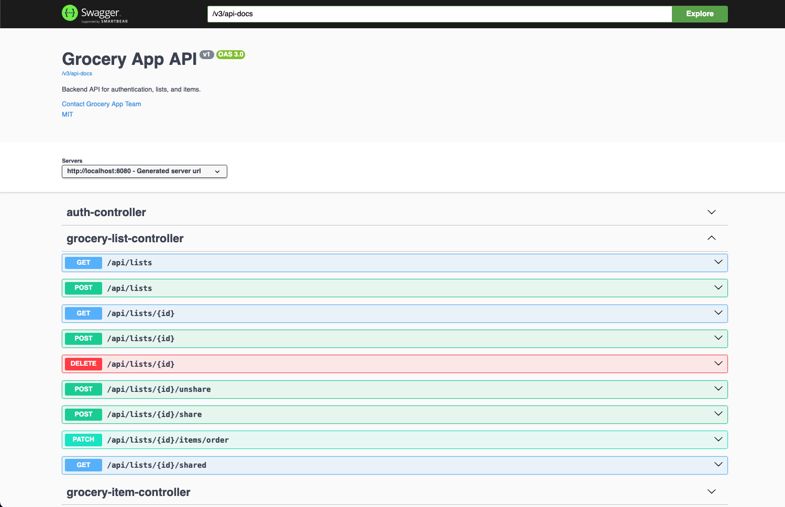
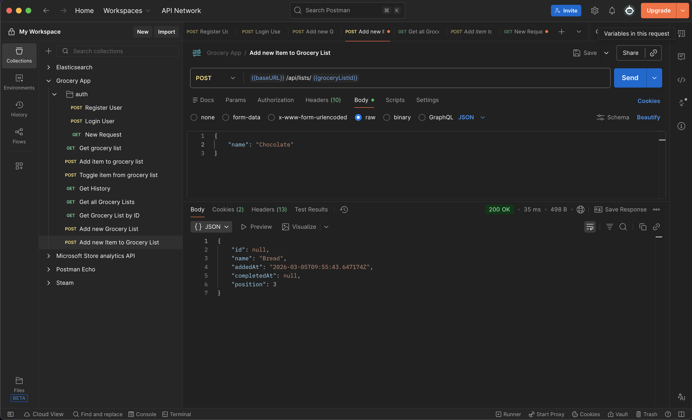
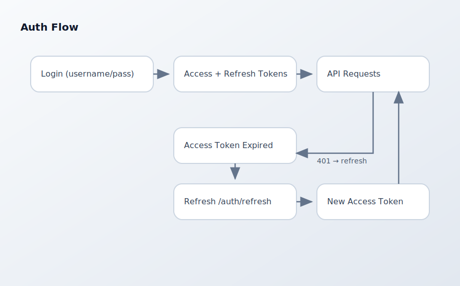

<h1 align="center">Grocery App Backend</h1>

<p align="center">
  
  
  
  
  
  
</p>

<p align="center">
  
  
  
  
</p>

<p align="center">
Backend of the Grocery App uses Spring Boot to build an API for handling authentication, lists, and item workflows.
</p>

## Highlights
- Token-based auth with refresh rotation
- Versioned database migrations (Flyway)
- Local dev profiles and test profile with embedded DB
- Clear, RESTful endpoints for lists and items

## Screenshots

| Swagger UI                                                                           | Postman                                                                  | Auth Flow |
|--------------------------------------------------------------------------------------|----------------------------------------------------------------------------------| --- |
|  |  |  |


## Getting Started

### Run locally
```bash
./mvnw spring-boot:run
```

### Run with test profile (embedded H2)
```bash
SPRING_PROFILES_ACTIVE=test ./mvnw spring-boot:run
```

## Profiles and Migrations
- `application.yml` uses `ddl-auto: validate` (schema must match migrations).
- `application-dev.yml` uses `ddl-auto: update` for local development.
- `application-test.yml` uses `ddl-auto: create-drop` and disables Flyway.
- Flyway migrations live in `src/main/resources/db/migration`.

## Database (PostgreSQL)

### Start service on macOS
```bash
brew services start postgresql
```

```bash
brew services list
```

### Create DB
```bash
createdb grocery_db
```

### Create DB user
```sql
-- Open psql as a superuser
psql postgres

-- Create a new database user (role)
CREATE USER grocery_user WITH PASSWORD 'gu_PA$$!';

-- Grant access to the database
GRANT CONNECT ON DATABASE grocery_db TO grocery_user;

-- Grant schema permissions
GRANT USAGE, CREATE ON SCHEMA public TO grocery_user;

-- Grant table permissions
GRANT SELECT, INSERT, UPDATE, DELETE ON ALL TABLES IN SCHEMA public TO grocery_user;

-- Grant sequence permissions
GRANT USAGE, SELECT, UPDATE ON ALL SEQUENCES IN SCHEMA public TO grocery_user;

-- Make permissions apply to future tables
ALTER DEFAULT PRIVILEGES IN SCHEMA public
GRANT SELECT, INSERT, UPDATE, DELETE ON TABLES TO grocery_user;

ALTER DEFAULT PRIVILEGES IN SCHEMA public
GRANT USAGE, SELECT, UPDATE ON SEQUENCES TO grocery_user;
```

### Connect to DB
```bash
psql -U grocery_user -d grocery_db
```

## API
Base URL:
```text
http://localhost:8080
```

Swagger UI:
```text
http://localhost:8080/swagger-ui/index.html
```

OpenAPI JSON:
```text
http://localhost:8080/v3/api-docs
```

Some endpoints:
```text
POST   /auth/login
POST   /auth/refresh
POST   /auth/logout
GET    /auth/health
GET    /auth/health/secure
GET    /api/lists
GET    /api/lists/{id}/
POST   /api/lists
POST   /api/lists/{id}/
DELETE /api/lists/{id}/
```

### Auth examples
```bash
curl -X POST http://localhost:8080/auth/login \
  -H "Content-Type: application/json" \
  -d '{"username":"demo","password":"demo"}'
```

```bash
curl -X POST http://localhost:8080/auth/refresh \
  -H "Content-Type: application/json" \
  -d '{"refreshToken":"<refresh-token>"}'
```

```bash
curl -X POST http://localhost:8080/auth/logout \
  -H "Content-Type: application/json" \
  -d '{"refreshToken":"<refresh-token>"}'
```

### Authenticated API example
```bash
curl http://localhost:8080/api/lists \
  -H "Authorization: Bearer <jwt>"
```

### Health check
```bash
curl http://localhost:8080/auth/health
```

```bash
curl http://localhost:8080/auth/health/secure \
  -H "Authorization: Bearer <jwt>"
```

## Auth Token Behavior
- Access token TTL is configurable via `auth.jwt.expiration-ms`.
- Refresh tokens are rotated on each `/auth/refresh`.
- Refresh token TTL is configurable via `auth.refresh-token.ttl-days`.

## Admin Registration
- `/auth/register` is restricted to `ADMIN` users.
- Configure the bootstrap admin via `auth.admin.username` and `auth.admin.password`.
- In `application-dev.yml`, the default admin is `admin` / `admin`.

## Project Structure
```text
src/
  main/
    java/
    resources/
      db/migration/
```

## License
MIT
