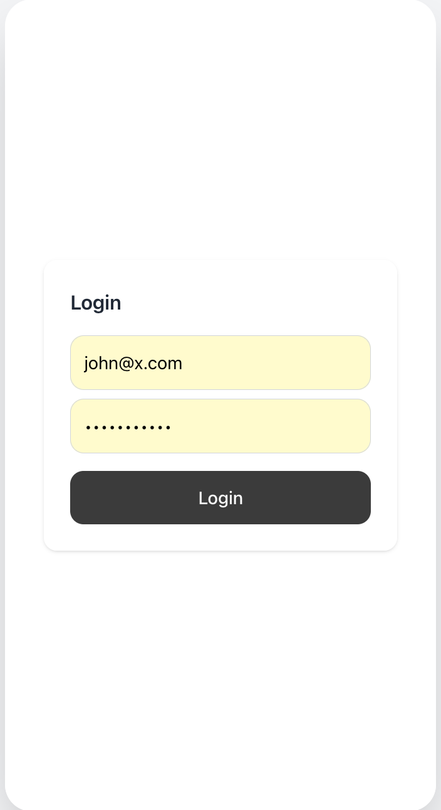
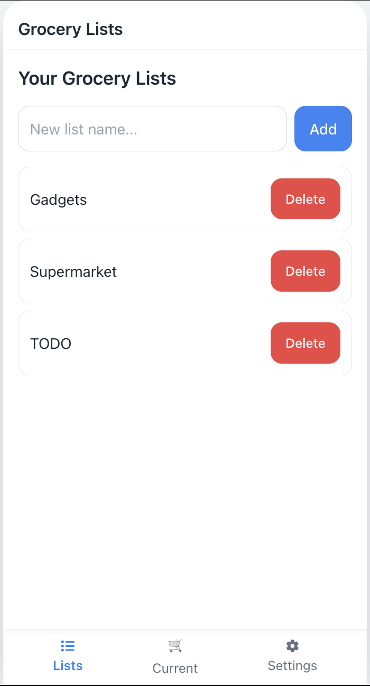
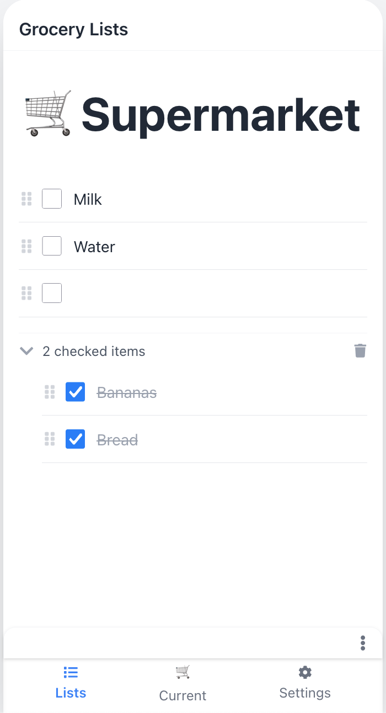
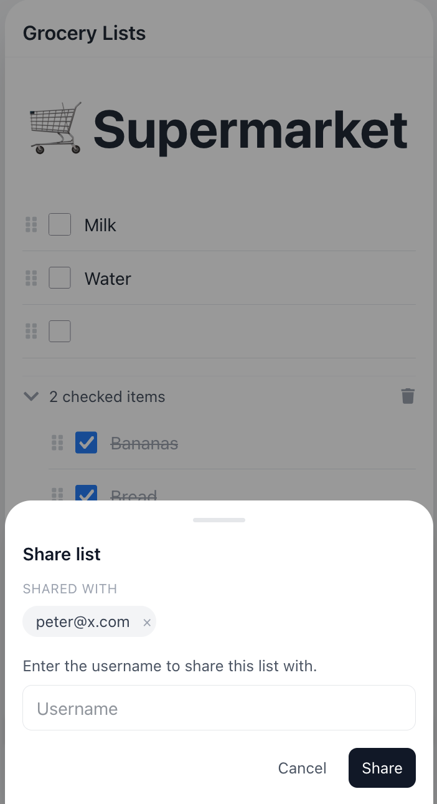
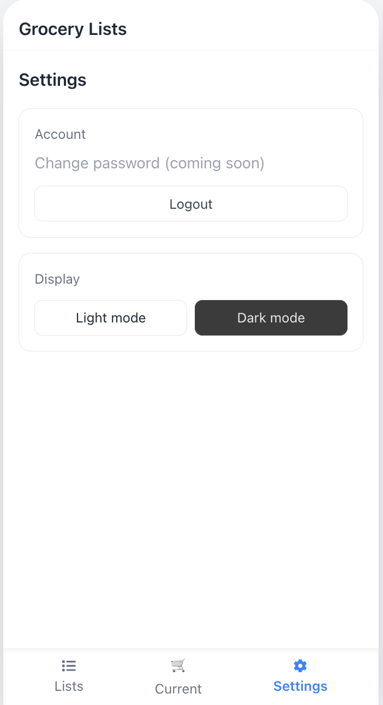
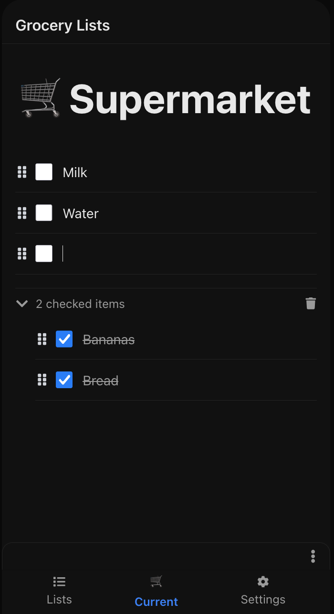
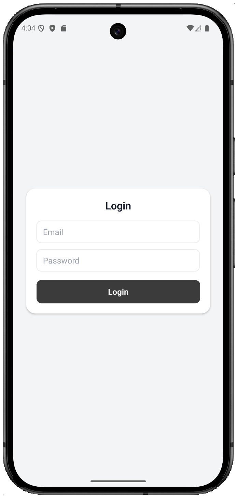
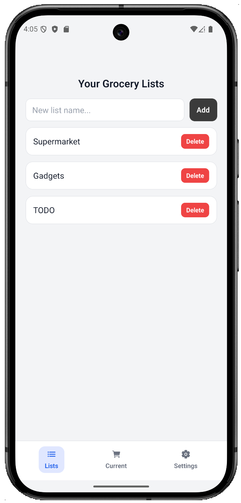
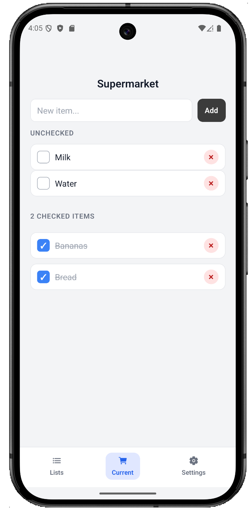
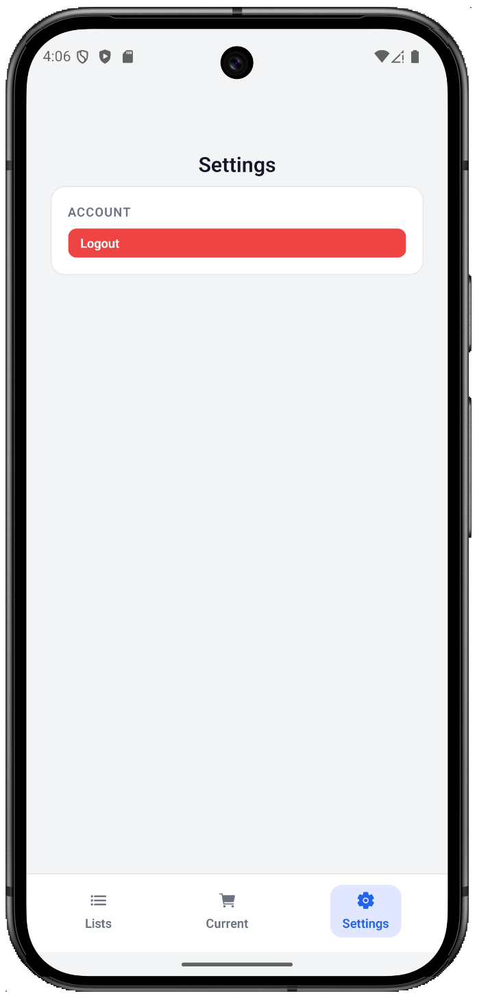

<h1 align="center">Grocery App Frontend</h1>

<p align="center">
  
  
  
  
</p>

<p align="center">A frontend monorepo for the Grocery App, with a fast web client and a mobile app.</p>

## Apps and Packages

- `apps/web` — React web app (Vite)
- `apps/mobile` — Expo/React Native app
- `packages/shared` — Shared logic

## Screenshots

### Web

<table>
    <tr>
      <th width="20%">Login</th>
      <th width="20%">Home</th>
      <th width="20%">List</th>
    </tr>
    <tr>
      <td width="20%"></td>
      <td width="20%"></td>
      <td width="20%"></td>
    </tr>
</table>

<table>
    <tr>
      <th width="33%">Share</th>
      <th width="33%">Settings</th>
      <th width="33%">Dark Mode</th>
    </tr>
    <tr>
      <td width="33%"></td>
      <td width="33%"></td>
      <td width="33%"></td>
    </tr>
</table>

### Mobile

<table>
    <tr>
        <th width="25%">Login</th>
        <th width="25%">Home</th>
        <th width="25%">List</th>
        <th width="25%">Settings</th>
    </tr>
    <tr>
        <td width="25%"></td>
        <td width="25%"></td>
        <td width="25%"></td>
        <td width="25%"></td>
    </tr>
</table>

## Quick Start

Pick one:

- Web: `apps/web/README.md`
- Mobile: `apps/mobile/README.md`

See each app for commands and environment notes:

- `apps/web/README.md`
- `apps/mobile/README.md`

## Root Scripts

- `pnpm run dev:web`
- `pnpm run build:web`
- `pnpm run lint:web`
- `pnpm run dev:mobile`
- `pnpm run ios:mobile`
- `pnpm run android:mobile`
- `pnpm run web:mobile`
- `pnpm run android:release:mobile`

## Recommended Workflow

- Start the backend from `../backend/spring`.
- Run the web app from `apps/web`.
- Add API base URL and auth values in app-specific `.env` files.

## Repo Layout

```text
apps/
  web/
  mobile/
packages/
  shared/
```

## License

MIT
